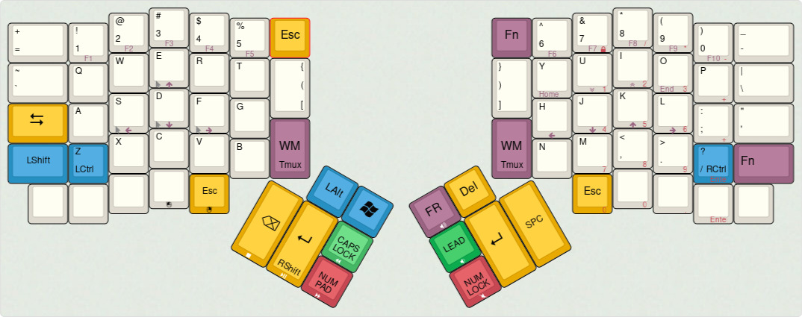

# tmpbeing's ergodox ez layout

This is my configuration layout for the Ergodox EZ shine using the [qmk firmware](https://github.com/qmk/qmk_firmware).

It is tailored to be used with vim/emacs, a tiling wm (i3) and tmux.



## Layout

The `FN` layer has function keys at the top, cursor movement and clicks on the
left, arrows, PgUp/Down and Home/End on the right and media keys at the bottom.

The `WM/Tmux` key when pressed a single time will go to the WM layer and hold
given modifier key until another key is pressed. When pressed twice it toggles
the TMUX layer and input the tmux prefix.

The `[{(` and `)}]` keys input square brackets when single tapped, parentheses when double
tapped and braves when shifted.

The `FR` layer is used to input french special characters.

## How to compile

```sh
$ git clone https://github.com/jackhumbert/qmk_firmware.git
$ cd qmk_firmware
$ ln -s /path/to/this/repo keyboards/ergodox_ex/keymaps/tmpbeing
```

```sh
$ make ergodox_ez:tmpbeing
```

## Flashing

To flash use [teensy_loader_cli](https://www.pjrc.com/teensy/loader_cli.html) or [wally](https://ergodox-ez.com/pages/wally).
